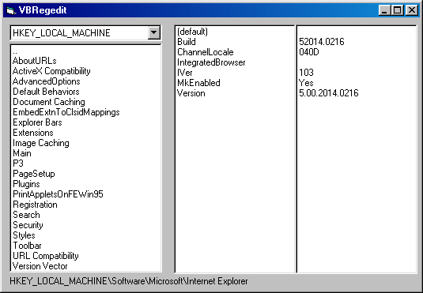



## VBRegedit \(Registery\)

### Description

This example shows you howto use the basic Regedit commands. it includes a Model that i've created using examples i found on the internet and code i've written.

You can Create/Delete/Display all Keys/Strings in the regisrtey,
 
### More Info
 

             |
---                |---
**Submitted On**   |2000-05-16 16:46:58
**By**             |[dark jedi](https://github.com/Planet-Source-Code/PSCIndex/blob/master/ByAuthor/dark-jedi.md)
**Level**          |Intermediate
**User Rating**    |4.8 (24 globes from 5 users)
**Compatibility**  |VB 5\.0, VB 6\.0
**Category**       |[Registry](https://github.com/Planet-Source-Code/PSCIndex/blob/master/ByCategory/registry__1-36.md)
**World**          |[Visual Basic](https://github.com/Planet-Source-Code/PSCIndex/blob/master/ByWorld/visual-basic.md)
**Archive File**   |[CODE\_UPLOAD58365162000\.zip](https://github.com/Planet-Source-Code/dark-jedi-vbregedit-registery__1-8134/archive/master.zip)

